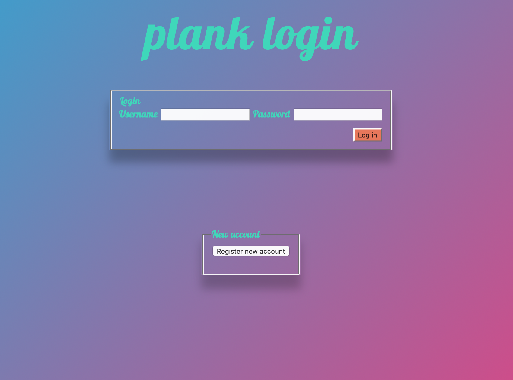

#plank

---

### Java v.11

### Apache Maven v 4.0

### MariaDB

### Dependencies

- Spring Boot
- Spring MVC
- Spring JPA
- Spring Web
- Spring Security
- Thymeleaf
- Spring MariaDB driver

### Languages

- Java
- Javascript
- HTML
- CSS

###To run

- Clone and download repository
- Create a database (MariaDB or Mysql) and set up the connection in "src/main/resources/application.properties"
- Run application and go to 127.0.0.1:8080/login